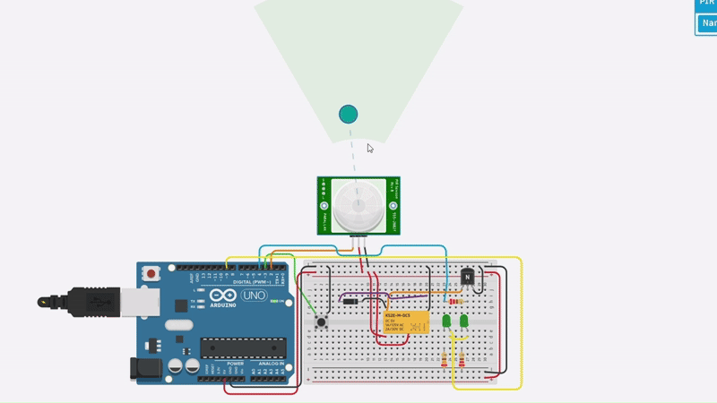

# Latching Power Switch Circuit with Auto Power Off and On



This project is a **battery-saving smart switch system** using an Arduino and a PIR motion sensor. The system acts as a *latching power switch* that turns on only when motion is detected and the user has toggled it on using a push button. When motion is no longer detected, the system automatically powers off, thus saving energy.

---

##  Features
- **Toggle Button** to turn the system ON/OFF manually
- **Motion Detection** using PIR sensor
- **Auto Power OFF** when no motion is detected
- **LED Indicators** to show system status
- **Relay Control** to power external devices

---

##  Components Used

| Component           | Quantity |
|--------------------|----------|
| Arduino Uno        | 1        |
| PIR Motion Sensor  | 1        |
| NPN Transistor (BJT) | 1      |
| 1N4007 Diode       | 1        |
| Push Button        | 1        |
| LED (Green)        | 2        |
| Resistors (220Ω)   | 3        |
| Relay Module       | 1        |
| Breadboard         | 1        |
| Jumper Wires       | As needed |

---

##  Circuit Overview

- The **Push Button** (connected to pin `3`) toggles the power state.
- The **PIR Sensor** (connected to pin `2`) detects motion.
- The **Transistor** (connected via pin `4`) acts as a switch to activate the relay and LEDs.
- A **Relay Module** controls external devices and shows the output visually with the LEDs connected.
- The **LED** connected to pin `9` shows when the system is active.

---

##  Code Explanation
```cpp
const int buttonPin = 3;       
const int sensorPin = 2;       
const int transistorPin = 4;   
const int ledPin2 = 9;         

bool isOn = false;             
bool lastButtonState = HIGH;   

void setup() {
  pinMode(buttonPin, INPUT_PULLUP);  
  pinMode(sensorPin, INPUT);          
  pinMode(transistorPin, OUTPUT);    
  pinMode(ledPin2, OUTPUT);          

  digitalWrite(transistorPin, LOW);  
  digitalWrite(ledPin2, LOW);        
}

void loop() {
  bool currentButtonState = digitalRead(buttonPin);

  if (currentButtonState == LOW && lastButtonState == HIGH) {
    isOn = !isOn;        
    delay(200);         
  }
  lastButtonState = currentButtonState;

  if (isOn && digitalRead(sensorPin) == HIGH) {
    digitalWrite(transistorPin, HIGH);  
    digitalWrite(ledPin2, HIGH);        
  } else {
    digitalWrite(transistorPin, LOW);   
    digitalWrite(ledPin2, LOW);         
  }
}
```

---

##  How It Works
1. **Initial State**: System is OFF.
2. **User presses the Toggle Button** → System turns ON (if motion is detected).
3. **PIR Sensor detects motion** → Transistor switches ON → Relay and LED activate.
4. **No more motion?** → System automatically shuts OFF.
5. **Press button again** to manually turn OFF anytime.

---

##  Folder Structure
```
project-folder/
│
├── demo.gif
├── README.md
└── sketch.ino (Arduino code)
```

---

##  Demo
Watch how the circuit behaves using the GIF above.

---

##  Author
- Designed and simulated by **Amjed**
